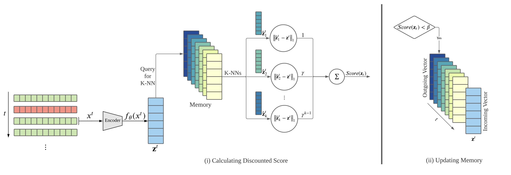

# MemStream

  
  

Implementation of

- [MemStream: Memory-Based Anomaly Detection in Multi-Aspect Streams with Concept Drift
](https://arxiv.org/pdf/2106.03837.pdf). Siddharth Bhatia, Arjit Jain, Shivin Srivastava, Kenji Kawaguchi, Bryan Hooi

MemStream augments a feature extractor like PCA, IB and AutoEncoder, with a Memory module to detects anomalies from a multi-aspect data stream. We output an anomaly score for each record.

After an initial training of the feature extractor on a small subset of normal data, MemStream processes records in two steps: (i) It outputs anomaly scores for each record by querying the memory for K-nearest neighbours to the record encoding and calculating a discounted distance and (ii) It updates the memory, in a FIFO manner, if the anomaly score is within an update threshold β.

## Datasets

Processed Datasets can be downloaded from [here](https://drive.google.com/file/d/1JNrhOr8U3Nqef1hBOqvHQPzBNWzDOFdl/view). Please unzip and place the files in the data folder of the repository.

## Demo

1. KDDCUP99: Run `python3 memstream.py --dataset KDD --beta 1 --memlen 256`
2. NSL-KDD: Run `python3 memstream.py --dataset NSL --beta 0.1 --memlen 2048`
3. UNSW-NB 15: Run `python3 memstream.py --dataset UNSW --beta 0.1 --memlen 2048`
4. CICIDS-DoS: Run `python3 memstream.py --dataset DOS --beta 0.1 --memlen 2048`
5. SYN: Run `python3 memstream-syn.py --dataset SYN --beta 1 --memlen 16`
6. Ionosphere: Run `python3 memstream.py --dataset ionosphere --beta 0.001 --memlen 4`
7. Cardiotocography: Run `python3 memstream.py --dataset cardio --beta 1 --memlen 64`
8. Statlog Landsat Satellite: Run `python3 memstream.py --dataset statlog --beta 0.01 --memlen 32`
9. Satimage-2: Run `python3 memstream.py --dataset satimage-2 --beta 10 --memlen 256`
10. Mammography: Run `python3 memstream.py --dataset mammography --beta 0.1 --memlen 128`
11. Pima Indians Diabetes: Run `python3 memstream.py --dataset pima --beta 0.001 --memlen 64`
12. Covertype: Run `python3 memstream.py --dataset cover --beta 0.0001 --memlen 2048`

## Command line options
  * `--dataset`: The dataset to be used for training. Choices 'NSL', 'KDD', 'UNSW', 'DOS'. (default 'NSL')
  * `--beta`: The threshold beta to be used. (default: 0.1)
  * `--memlen`: The size of the Memory Module (default: 2048)
  * `--dev`: Pytorch device to be used for training like "cpu", "cuda:0" etc. (default: 'cuda:0')
  * `--lr`: Learning rate (default: 0.01)
  * `--epochs`: Number of epochs (default: 5000)

## Input file format
MemStream expects the input multi-aspect record stream to be stored in a contains `,` separated file.

## Datasets
1. [KDDCUP99](http://kdd.ics.uci.edu/databases/kddcup99/kddcup99.html)
2. [NSL-KDD](https://www.unb.ca/cic/datasets/nsl.html)
3. [UNSW-NB 15](https://www.unsw.adfa.edu.au/unsw-canberra-cyber/cybersecurity/ADFA-NB15-Datasets/)
4. [CICIDS-DoS](https://www.unb.ca/cic/datasets/ids-2018.html)
5. Synthetic Dataset (Introduced in paper)
6. [Ionosphere](https://archive.ics.uci.edu/ml/index.php)
7. [Cardiotocography](https://archive.ics.uci.edu/ml/index.php)
8. [Statlog Landsat Satellite](https://archive.ics.uci.edu/ml/index.php)
9. [Satimage-2](http://odds.cs.stonybrook.edu)
10. [Mammography](http://odds.cs.stonybrook.edu)
11. [Pima Indians Diabetes](https://archive.ics.uci.edu/ml/index.php)
12. [Covertype](https://archive.ics.uci.edu/ml/index.php)

## Environment
This code has been tested on Debian GNU/Linux 9 with a 12GB Nvidia GeForce RTX 2080 Ti GPU, CUDA Version 10.2 and PyTorch 1.5.
